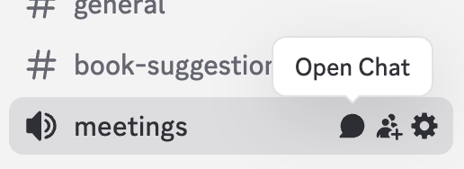
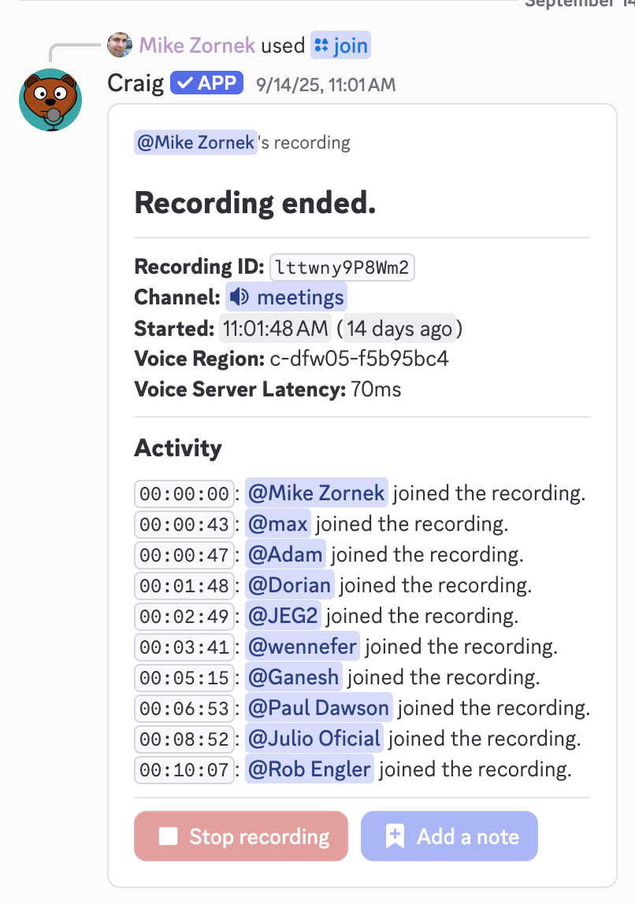
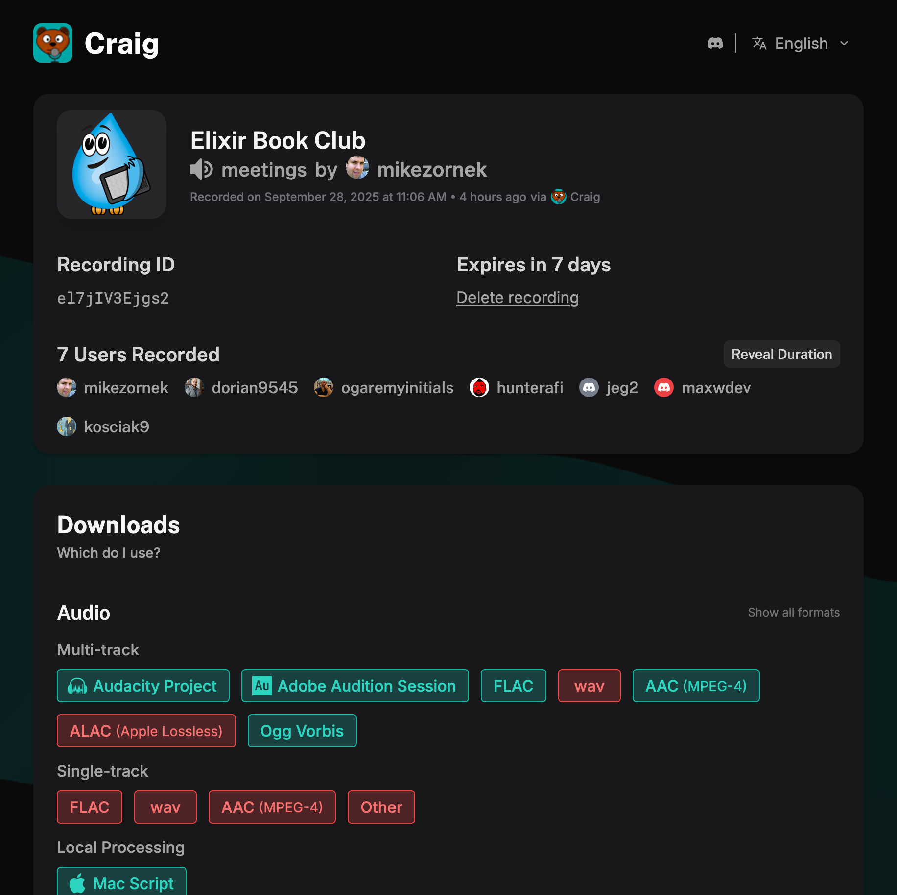

# How To Run a Meeting

This document outlines what to do if you are responsible to moderating our book club meeting.

## Meeting Moderation

If you will be running a meeting ask `@zorn` for a `Mods` role. That might be required to interact with some of the plugins and event actions.

Meetings happen on our Discord and are scheduled to start at 11am Easter Time inside the `#meetings` room.

Show up 5 minutes early. When you enter the room it may suggest "starting" the calendar event. Feel free to do so. I don't think it does much but will change the status in the `Events` list.

As people start popping in, give them a little hello to acknowledge their arrival and that your microphone is working properly. I tend to start the meeting around 11:02am.

Start the call by sharing notice of the recording.

> Before we get going I want to share this meeting will be recorded and shared within the Discord for folks who could not make it. If you happen to share something curing the call you do not want included in the archive, let us know and we can trim it out.

Then invite the recording bot by using the `#meetings` room chat room, and entering `/join channel #meetings` as a chat message. The bot should join the call and a status card will show up in chat log.

Start the meeting with a clear intro:

> Welcome everyone today is Sunday DATE, and this is the Elixir Book Club. Today we will be discussing chapters x and y of book name.

I tend to do a quick recap of the chapter, and then open the floor to discussion. It is important to let the room hit those awkward silence moments to encourage people to speak up. Generally people are pretty good about not speaking over each other, but as moderator do speak up and manage the floor as needed.

Watch the clock and interject with a summary of the second chapter to keep the meeting moving along. Use your judgement, as we value good conversations over chapter checklists.

During quiet time feel free to refer to the shared notes to kick off points to discuss.

As you get close to the hour wrap up the meeting giving people an opportunity for final comments or shares.

Thank people for their time and announce the chapter goals for the next meeting. Tell them if they have anything to share in-between meeting times, feel free to chat on Discord.

Before you leave the room, end the Discord event and go back to the recording bot's card to hit `Stop recording`.

## Post Meeting Tasks

(If you are moderating while `@zorn` is away he can do most of this, just be sure to send him the download links.)

After a meeting, there is a manual task of updating the `Next Event` date on the website. This is a simple HTML page and I usually just edit the file inline on GitHub, committing directly to `main` (which will publish the changes).

As for the recording, the robot's card will turn into a `Download` button. When you visit the website the recording will be offered in a few different formats. 

I tend to download the Audacity project format and have the server normalize the audio waves. Using the app on my local computer I clean up any issues (rare, but sometimes a rogue mic adds a lot of noise), and export a mono MP3. I store the archives on my personal Dropbox and share a link to it.

The recording will only be hosted for 7 days, so be sure to download it quickly after the meeting.

If needed I'll add new Discord Events. I usually do these in bunches, just to make sure there are a few in the list.
